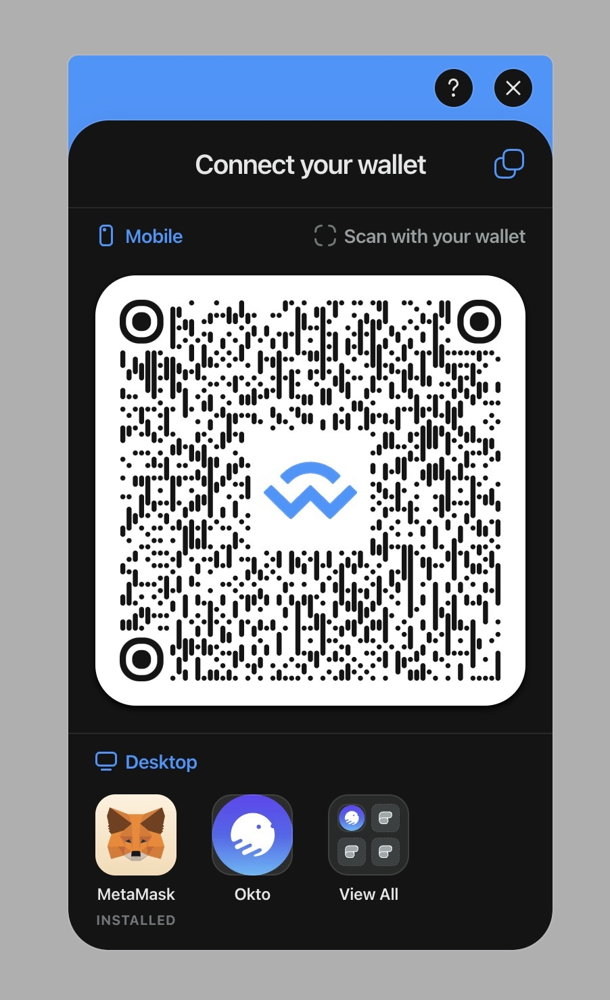
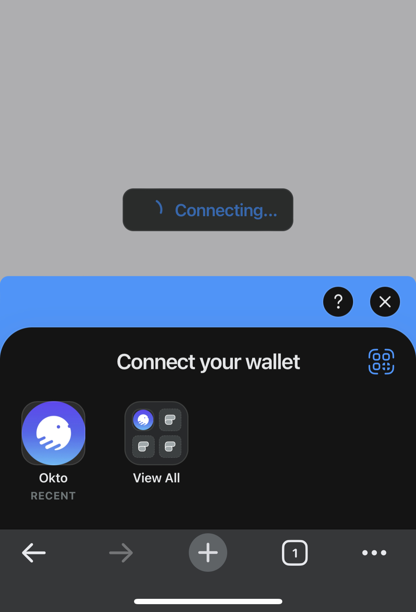
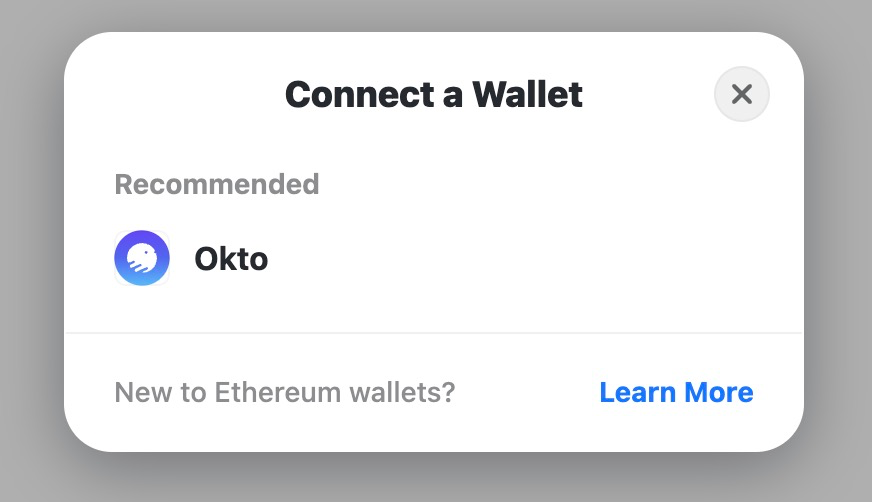
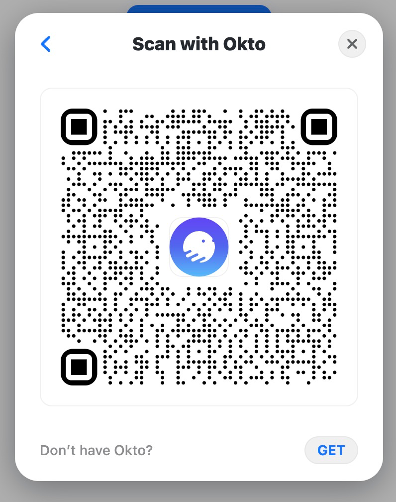

# Integrate WC with Okto Wallet

## Using Web3Modal

Steps:

1. Add Wallet Connect Web3Modal to the dapp. Follow [this](https://docs.walletconnect.com/2.0/web3modal/about) documentation for help.
2. To integrate Web3Modal with Okto Wallet add the following parameters to the Web3Modal Config.
   - `themeVariables`: {  
     "--w3m-logo-image-url": "https://raw.githubusercontent.com/coindcx-okto/okto-wc/main/assets/okto-white-text-logo.svg"  
     }
   - `explorerRecommendedWalletIds`: 550b59942eb58a7226381bf7935f22d311e56ee29c3530e44d96b1de0550a35a

**Example:**

```jsx
<Web3Modal
  projectId={projectId}
  ethereumClient={ethereumClient}
  themeVariables={{
    "--w3m-logo-image-url":
      "https://raw.githubusercontent.com/coindcx-okto/okto-wc/main/assets/okto-white-text-logo.svg",
  }}
  explorerRecommendedWalletIds={[
    "550b59942eb58a7226381bf7935f22d311e56ee29c3530e44d96b1de0550a35a",
  ]}
/>
```

After implementation, the web3modal will look like this:

| On Desktop                                                                                    | On Mobile                                                                                    |
| --------------------------------------------------------------------------------------------- | -------------------------------------------------------------------------------------------- |
|  |  |

## [WIP] Using Rainbow Kit

> ⚠️ **This option is still in WIP.** We are waiting for Rainbow team to merge our PR.

Steps:

1. Add Rainbow Kit to the dapp. Follow [this](https://www.rainbowkit.com/docs/introduction) documentation for help.
2. To integrate RainbowKit with Okto Wallet add the following parameters to the Rainbow Kit Config.

**Example**:

```jsx
import {
  oktoWallet,
} from '@rainbow-me/rainbowkit/wallets';

...

const connectors = connectorsForWallets([
  {
    groupName: 'Recommended',
    wallets: [
      oktoWallet({ chains, projectId }),
      ...
    ],
  },
]);

```

After implementation, the rainbow kit modal will look like this:

|                                                                                 |                                                                                 |
| ------------------------------------------------------------------------------- | ------------------------------------------------------------------------------- |
|  |  |

---
